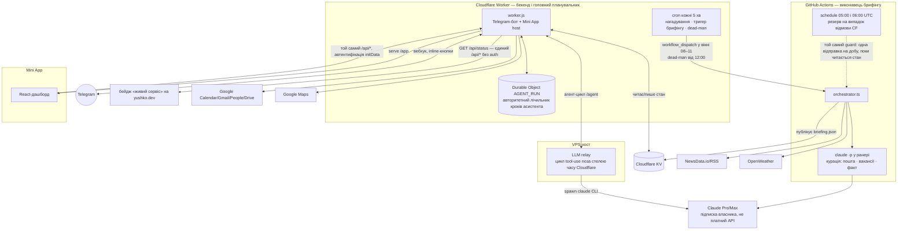

# Svitanok 🌅

Персональний Telegram-застосунок «на кожен день»: щоранку структурований
брифінг (погода, календар, новини, курс, факт, мок-питання співбесіди), LLM-
асистент, з яким спілкуєшся вільним текстом (календар, нагадування, пошта,
контакти, Drive), і Mini App-дашборд для трекінгу пошуку роботи, життя й
навчання. Один власник, ніякої реєстрації/мультитенантності.

> 📜 [SPEC.md](SPEC.md) — оригінальний дизайн-бриф (Ревізія 5.1, MVP-фаза).
> Історичний документ: описує архітектуру ДО асистента, Mini App, воронки
> вакансій і трекера життя. Цей README — актуальний стан проєкту сьогодні;
> де вони розходяться (git-flow, дашборд, стан), довіряй README.
>
> 📚 [docs/canon/](docs/canon/) — проєктна документація асистента (v1):
> бачення, архітектура, ADR-и, сценарії, ops, схема даних.
> 🙋 [docs/capabilities.md](docs/capabilities.md) — що вміє асистент, для власника.

## Зміст

- [Архітектура](#архітектура)
- [Функціонал](#функціонал)
  - [Ранковий брифінг](#ранковий-брифінг-github-actions)
  - [Telegram-команди](#telegram-команди)
  - [🤖 Асистент](#-асистент-вільний-текст)
  - [Mini App](#mini-app-дашборд)
- [Підключені сервіси](#підключені-сервіси)
- [Дані та стан](#дані-та-стан-cloudflare-kv)
- [Структура репозиторію](#структура-репозиторію)
- [Конфігурація та секрети](#конфігурація-та-секрети)
- [Розробка](#розробка)
- [Налаштування з нуля](#налаштування-з-нуля)

---

## Архітектура

Чотири окремі компоненти, кожен зі своєю моделлю деплою:



**Чотири речі, яких на старій схемі не було видно взагалі.**

1. **Тригерів у брифінгу два, і точний — не GitHub.** Час дає Worker: тік
   кожні 5 хвилин, `workflow_dispatch` у вікні 08–11 Київ, ідемпотентно за
   добу. `schedule` самого GitHub лишається резервом на випадок відмови
   Cloudflare (два крони під DST) — він спрацьовує пізніше, але той самий
   guard не дасть дубль. Плюс dead-man від 12:00: якщо брифінг не пішов, це
   помітить не власник, а система.
2. **Шляхів до Claude два, і вони незалежні.** Курація брифінгу спавнить
   `claude -p` ПРЯМО В РАНЕРІ Actions (пін версії CLI, `--tools ''`), а
   асистент ходить через VPS-реле. Падіння одного не забирає другий.
3. **Стан асистента живе не тільки в KV.** Лічильник кроків прогону — Durable
   Object на SQLite: у KV немає ні CAS, ні read-your-writes, тож «скільки кроків
   уже зроблено» там було б здогадкою, а не фактом.
4. **Дані власника віддає рівно один `/api/*`-маршрут без автентифікації.**
   `GET /api/status` — одне поле, мітка часу останнього брифінгу, з ОКРЕМОГО
   KV-ключа. Решта `/api/*` закрита, але не однаково: `/api/telegram` і
   `/api/telegram/setup` — секретом вебхука (`X-Telegram-Bot-Api-Secret-Token`),
   `/api/agent-step` — спільним секретом VPS-хоста плюс підписаним ран-токеном,
   і лише все інше — HMAC-перевіркою `initData` власника. Статика Mini App
   (`/app/*`) публічна за призначенням: це фронтенд, який без `initData` показує
   демо-дані.

| Компонент                                            | Що робить                                                                                                                                               | Деплой                                                                                                                         |
| ---------------------------------------------------- | ------------------------------------------------------------------------------------------------------------------------------------------------------- | ------------------------------------------------------------------------------------------------------------------------------ |
| **GitHub Actions orchestrator** (`src/`)             | Раз на день будує й надсилає ранковий брифінг: детерміновані модулі (погода/курс/новини-RSS) + кураційні через `claude -p` (вакансії/пошта/факт/мок)    | `workflow_dispatch` від крону Worker (`schedule` у `brief.yml` — резерв), читає/пише стан у Cloudflare KV напряму через CF API |
| **Cloudflare Worker** (`web/*.mjs`, `web/worker.js`) | Бекенд Telegram-бота: команди, inline-кнопки, вебхук, LLM tool-use асистент, `/api/*` для Mini App                                                      | Автодеплой із `main` через Git-інтеграцію Cloudflare (push у `main` = живий прод за секунди)                                   |
| **VPS LLM-хост** (`host/`)                           | Тонке реле: приймає запит від Worker, спавнить `claude` CLI під підпискою власника (не платне API), гарантує цикл tool-use без обмежень часу Cloudflare | **Вручну**: `scp` + `systemctl restart` (див. `host/README.md`) — НЕ автодеплоїться разом із Worker                            |
| **Mini App** (`web/app/`, React)                     | Дашборд: сьогодні, новини, вакансії (список/канбан), чек-ін, статистика, налаштування, збережене                                                        | Той САМИЙ деплой, що Worker — Cloudflare білдить `web/app` і кладе результат у `web/public/app`, деплоїть разом                |

**Чому VPS-хост, а не виклик Claude API прямо з Worker.** Дві причини, обидві — реальні інциденти під час розробки:

1. Cloudflare вбиває фонову роботу (`ctx.waitUntil`) **мовчки** приблизно через 25–30с. Багатокроковий tool-use асистента (пошта → тіло листа → пропозиція) довший — на 3-му колі відповідь просто зникала.
2. Курація й асистент працюють на **Pro/Max-підписці власника** через `claude` CLI (`claude setup-token`), не на платному Messages API — це свідоме рішення про вартість. VPS тримає CLI живим без обмежень часу; Worker лише передає йому запит і отримує відповідь назад через підписаний callback.

---

## Функціонал

### Ранковий брифінг (GitHub Actions)

Один структурований блок-повідомлення, ~08:00 Київ щодня; неділя — розширений
weekly review. Модулі (`src/modules/`), кожен незалежний (падіння одного не
валить брифінг):

| Модуль          | Тип      | LLM?       | Що робить                                                                                                |
| --------------- | -------- | ---------- | -------------------------------------------------------------------------------------------------------- |
| `stoic`         | consumer | ні         | Цитата дня (public domain, детермінована ротація за днем року)                                           |
| `weather`       | producer | ні         | Погода по двох локаціях (геопозиція з Mini App + `OWNER_LOCATIONS`) через OpenWeather One Call 3.0 + AQI |
| `calendar`      | producer | ні         | Сьогоднішні події Google Calendar (`calendar.readonly`)                                                  |
| `news`          | consumer | ні         | NewsData.io (теми за scope×category) + RSS-стрічки; дедуп, ваги ❤️ на тему                               |
| `jobs`          | consumer | так        | DOU + Djinni RSS → LLM-скоринг релевантності (fit %) під профіль                                         |
| `mail`          | producer | так        | Gmail-тріаж (лише метадані), виявляє запрошення на співбесіду                                            |
| `fact`          | consumer | так (батч) | «Факт дня» — один виклик генерує пачку на ~2 тижні наперед                                               |
| `mock`          | consumer | так (батч) | Питання співбесіди дня — той самий батч-кеш, що `fact`                                                   |
| `currency`      | consumer | ні         | Курс НБУ + 14-денна історія — лише дашборд                                                               |
| `onthisday`     | consumer | ні         | «У цей день» з Wikipedia — лише дашборд                                                                  |
| `weekly-review` | consumer | ні         | Недільний підсумок: новини за тиждень, роадмеп-прогрес, слабкі теми                                      |

Курація (jobs/mail/fact/mock) іде через `claude -p` — модель `claude-haiku-4-5`
(пінована в `config.yml`, не Sonnet: за латентністю на довгих промптах Haiku
надійніший на `claude -p`). Одна LLM-курація, одна дедуплікація, `maxCallsPerRun`
як запобіжник квоти.

### Telegram-команди

Вісім - решта живе природною мовою або в Mini App (реліз 08.09.2026: реєстр із
шістнадцяти команд дублював екрани дашборда й вільний текст).

| Команда      | Опис                                                          |
| ------------ | ------------------------------------------------------------- |
| `/help`      | Що я вмію - коротко                                           |
| `/plan`      | План на день                                                  |
| `/remind`    | Список нагадувань; з текстом - нове                           |
| `/brief`     | Ранковий брифінг зараз                                        |
| `/status`    | Чи все живе + `chat_id`/`thread_id` цього чату                |
| `/clear [N]` | Прибрати останні N обмінів (Telegram не дає старші за 48 год) |
| `/new`       | Почати нитку розмови з чистого аркуша (памʼять лишається)     |
| `/forget`    | Меню стирання даних - завжди зі словом-підтвердженням         |

Кнопка-меню Telegram показує саме цей список; Mini App - у закріпленому
повідомленні. Обробники прибраних команд (`/stats`, `/jobs`, `/agenda`,
`/roadmap`, `/whereami`, …) лишились робочими: хто набере руками - дістане
відповідь, а не «невідома команда».

### 🤖 Асистент (вільний текст)

Повний перелік можливостей - [docs/capabilities.md](docs/capabilities.md).

Пишеш звичайним текстом (у темі «🤖Асистент» чи в DM). Запит іде в **мозок**
(Claude Agent SDK на VPS, `brain/`), який ходить в інструменти ядра через
підписані виклики `/internal/*`; ядро (`web/core/`) вирішує рівень дії,
виконує її і відповідає власнику. Модель не має ані прямого доступу до
Telegram, ані права виконати дію повз політику.

**Рівні підтвердження** (`web/core/policy/core.mjs`, `ACTION_LEVELS`):

- **T0** - своє й зворотне: нагадування, факти, ідеї, бажання, колекції, план
  дня, задача в Tasks, нотатка в Drive, подія в календарі **без гостей**,
  експорт колекції. Робиться одразу, під відповіддю - «↩» на 10 хв.
- **T1** - видно іншим або коштує грошей: подія **з гостями**, запрошення,
  контакт, налаштування, генерація зображення. Одне ✅/❌, TTL 30 хв.
- **T2** - незворотне або дороге: стирання даних, експорт усього, відео.
  ✅ + слово-підтвердження з випадковим суфіксом, яке називає **ядро**
  (модель його не бачить).

**Захист від інʼєкцій.** Вміст листів, чужих чатів і сайтів позначає сесію
як «заплямовану» на 10 хв. У такій сесії до ✅ підіймаються **лише дії
назовні** (календар, Tasks, Drive, експорт) - записи у власну базу
лишаються миттєвими. Генерація Gemini в заплямованій сесії заборонена
зовсім: власник підтвердив би картинку, не бачачи, що в prompt переказано
лист.

**Працівники** (`docs/assistant/agents/`): Дослідник, Аналітик, Планувальник,
Копірайтер, Редактор, Фінансист, Секретар-пошта, Навчальний, Денний,
Код-оглядач. Модель делегує їм задачу з форматом, не розмову.

### Mini App (дашборд)

React-застосунок на `/app` (і на `/` — старий рукописний дашборд видалено).
П'ять вкладок + два повноекранні маршрути:

| Екран                      | Що показує                                                                                                                                             |
| -------------------------- | ------------------------------------------------------------------------------------------------------------------------------------------------------ |
| Сьогодні                   | Погода+сонячний годинник, курс, факт дня, мок-питання, цитата, «у цей день»                                                                            |
| Новини                     | 🌍 Світ / 🇺🇦 Україна, згруповано за темою, ❤️ на тему                                                                                                  |
| Вакансії                   | Список (сортовано за fit %) або канбан-воронка (drag&drop)                                                                                             |
| Чек-ін                     | Три часові блоки (ранок/день/вечір), стани locked/open/done/missed — **не можна заповнити заднім числом** (вгаданий пропуск зіпсував би криву енергії) |
| Статистика                 | Стрік, чек-іни, воронка+ціль, мастерність тем, інтереси, надійність доставки                                                                           |
| Налаштування (`/settings`) | Тумблери модулів, тихі години, статус конекторів (read-only), демо-перемикач                                                                           |
| Збережене (`/saved`)       | Повний пагінований архів збереженого (окремо від прев'ю в статистиці)                                                                                  |

Той самий `/api/*`, що й бот; авторизація — Telegram WebApp `initData`
(HMAC-перевірка + звірка з `TELEGRAM_OWNER_USER_ID`). Поза Telegram чи без
валідної сесії — деградує до демо-даних, не падає.

---

## Підключені сервіси

| Сервіс                       | Навіщо                                                                                                       | Авторизація                                                                                                              |
| ---------------------------- | ------------------------------------------------------------------------------------------------------------ | ------------------------------------------------------------------------------------------------------------------------ |
| **Telegram Bot API**         | Увесь інтерфейс — повідомлення, команди, inline-кнопки, вебхук                                               | Bot token; вхідний вебхук звіряє `X-Telegram-Bot-Api-Secret-Token`                                                       |
| **Google Calendar**          | Читання (брифінг) + повний CRUD подій (асистент): гості, локація, накладки часу                              | OAuth refresh token, скоупи `calendar.readonly`+`calendar.events`                                                        |
| **Gmail**                    | Тріаж вакансій/співбесід (брифінг) + пошук/читання листа (асистент) — **лише читання**, ніколи не відправляє | Той самий refresh token, скоуп `gmail.readonly`                                                                          |
| **Google People (Contacts)** | Резолюція імені гостя в email; збереження нового контакту з чату                                             | Той самий refresh token, скоупи `contacts.readonly`+`contacts` — **потребує окремого ре-консенту власника** (див. нижче) |
| **Google Drive**             | Пошук файлу за назвою (напр. резюме) — лише назва+посилання, без читання вмісту                              | Той самий refresh token, скоуп `drive.readonly` — **потребує окремого ре-консенту власника**                             |
| **Google Maps**              | Клікабельне посилання під локацією події                                                                     | **Без авторизації** — universal search-URL, не окрема інтеграція, не платиться                                           |
| **NewsData.io + RSS**        | Джерела новин для брифінгу й дашборда                                                                        | API-ключ (NewsData) або взагалі без ключа (чисті RSS-стрічки)                                                            |
| **OpenWeather**              | Погода + якість повітря                                                                                      | API-ключ, потрібна підписка «One Call by Call» на тому ж ключі                                                           |
| **НБУ (курс валют)**         | Курс USD/EUR/PLN/GBP + історія                                                                               | Публічне API, без ключа                                                                                                  |
| **Wikipedia (uk)**           | «У цей день»                                                                                                 | Публічне API, без ключа                                                                                                  |
| **Claude (Pro/Max)**         | Курація брифінгу + LLM tool-use асистент                                                                     | `claude setup-token` (OAuth-токен підписки), НЕ платний API-ключ                                                         |
| **GitHub Actions API**       | Worker точно тригерить ранковий cron-job (не чекає на розкид cron)                                           | Personal Access Token зі скоупом `workflow_dispatch`                                                                     |

**Про Google-скоупи:** усі чотири Google-інтеграції діляться **одним**
refresh-токеном (`GOOGLE_REFRESH_TOKEN`) — один консент покриває все. Calendar
і Gmail уже активні. Contacts (write) і Drive (readonly) — код уже написаний і
задеплоєний з graceful-деградацією (403 → «недоступно», нічого не падає), але
самі скоупи власник додає окремим ручним походом на екран згоди Google (не
автоматизується, не видно Claude Code) — після цього той самий токен покриває
геть усе одразу.

---

## Дані та стан (Cloudflare KV + Durable Objects)

Один namespace `BRIEFING`. Замість одного великого блоба — **окремі ключі для
кожного незалежного писаря**, свідомо: спільний блоб під конкурентним записом
(вебхук + крон + дашборд одночасно) губить дані без CAS. Це вже раз ламало
прод (пропозиції асистента губились під затиранням `state`) — з того часу
кожен новий тип даних, що пишеться незалежно, отримує власний ключ.

| Ключ                            | Зміст                                                                       |
| ------------------------------- | --------------------------------------------------------------------------- |
| `state`                         | compatibility snapshot; canonical mutable state — `StateStoreDO`            |
| `stats`                         | compatibility snapshot; canonical статистика — `StateStoreDO`               |
| `settings`                      | compatibility snapshot; canonical налаштування — `StateStoreDO`             |
| `latest` / `briefing:<дата>`    | останній опублікований брифінг + історія по датах                           |
| `assistantPending`              | compatibility seed/mirror; atomic pending slot — `PendingProposalsDO`       |
| `assistantHistory`              | історія розмови з асистентом за темою/чатом                                 |
| `agentRuns` / `agentHostHealth` | rollback-ledger прогонів / стан здоров'я VPS; active runs — `RunRegistryDO` |
| `googleToken`                   | кешований Google access-токен (~1год TTL)                                   |
| `sentMessages`                  | compatibility snapshot; atomic `/clear` ring buffer — `SentMessagesDO`      |
| `briefDispatch`                 | дедуп ранкового автозапуску                                                 |

---

## Структура репозиторію

```
svitanok/
  .github/workflows/
    brief.yml           # cron (05:00+06:00 UTC) + workflow_dispatch, guard-гейт, публікація в KV
    ci.yml               # PR-гейт: typecheck+lint+format+test, окрема job на білд дашборда
  src/
    orchestrator.ts       # load → guard → producers → consumers → render → send → KV
    core/                 # types, config(+zod), guard, clock, llm(claude -p), fetcher,
                           # state-kv, telegram, render, url, google-auth, settings-overrides…
    modules/               # stoic, weather, calendar, news, jobs, mail, fact, mock,
                           # currency, onthisday, weekly-review
    data/stoic.json        # цитати за днем року
  host/                    # VPS LLM-реле: server.mjs, llm-host-core.mjs, agent-loop-core.mjs,
                           # systemd unit, README з кроками розгортання/оновлення
  web/
    worker.js              # Cloudflare Worker: команди, вебхук, /api/*, агент-оркестрація
    agent-core.mjs          # схема дій асистента, системний промпт, санітизація пропозицій
    calendar-core.mjs, reminders-core.mjs, roadmap-core.mjs, stats-core.mjs,
    settings-core.mjs, assistant-data-core.mjs, assistant-memory-core.mjs,
    mastery-core.mjs, tg-core.mjs, agent-run-core.mjs   # чиста логіка, без I/O — тестована окремо
    app/                    # React Mini App (Vite+Tailwind+TanStack Query), білдиться в web/public/app
    wrangler.jsonc
  scripts/
    check-telegram.mjs      # діагностика бота / пошук chat_id
    guard.mjs               # той самий guard, що orchestrator, для CI-гейту
  tests/                   # дзеркалить src/ і web/ — vitest, ≈2000 тестів (web/app має власні ≈80)
  other/                   # референс-матеріали дизайну (не частина деплою)
  config.yml
  .env.example
  SPEC.md                  # історичний дизайн-бриф (див. примітку вгорі)
```

---

## Конфігурація та секрети

**`config.yml`** — таймзона, вікно відправки, локації погоди, тумблери й
параметри кожного модуля брифінгу, модель/ліміти LLM. Невалідний конфіг падає
гучно на старті (zod).

**Секрети — у ДВОХ місцях, синхронізовано вручну:**

- **GitHub Secrets** — читає `brief.yml` (оркестратор).
- **Cloudflare Worker secrets** (`wrangler secret put`) — читає `worker.js`.

Google-трійка (`GOOGLE_CLIENT_ID/SECRET/REFRESH_TOKEN`), теми супергрупи
(`TOPIC_*`) і `MINI_APP_URL` мусять бути **однакові в обох місцях** —
оркестратор і Worker читають їх незалежно, і одне оновлене місце без другого
дає тихий розсинхрон поведінки. `MINI_APP_URL` у Worker — новий секрет
(`wrangler secret put MINI_APP_URL`, те саме значення, що вже є в GitHub
Secrets): без нього щоденний автозапуск `/api/telegram/setup` (нижче) тихо
пропускається, а решта Worker'а працює як і раніше.

| Група                     | Змінні                                                                                                      | Призначення                                                                          |
| ------------------------- | ----------------------------------------------------------------------------------------------------------- | ------------------------------------------------------------------------------------ |
| Критичні                  | `TELEGRAM_BOT_TOKEN`, `TELEGRAM_CHAT_ID`, `TELEGRAM_OWNER_USER_ID`, `MINI_APP_URL`, `TELEGRAM_BOT_USERNAME` | без токена/chat_id брифінг узагалі не шлеться (рання валідація, видимий фейл)        |
| Погода                    | `WEATHER_API_KEY`                                                                                           | OpenWeather, потрібна підписка One Call 3.0                                          |
| Карти (Worker)            | `MAPS_API_KEY`                                                                                              | Google Maps Platform: Places (New), Routes, Geocoding - інструменти асистента        |
| Знижки на ігри (Worker)   | `ITAD_API_KEY`                                                                                              | IsThereAnyDeal: щоденна перевірка цін на бажання type=game (задача `steam-check`)    |
| Claude                    | `CLAUDE_CODE_OAUTH_TOKEN`                                                                                   | `claude setup-token`, курація брифінгу                                               |
| Переклад (опційно)        | `GOOGLE_TRANSLATE_API_KEY`                                                                                  | Cloud Translation, прозові world-теми en->uk (`translate: true` у config.yml)        |
| Google                    | `GOOGLE_CLIENT_ID`, `GOOGLE_CLIENT_SECRET`, `GOOGLE_REFRESH_TOKEN`                                          | Calendar+Gmail(+Contacts+Drive після ре-консенту)                                    |
| Worker-лише               | `GH_DISPATCH_TOKEN`, `TELEGRAM_WEBHOOK_SECRET`, `LLM_HOST_URL`, `LLM_HOST_SECRET`                           | точний cron-тригер, вебхук, VPS-хост                                                 |
| Теми супергрупи (опційно) | `TOPIC_BRIEFING`, `TOPIC_ASSISTANT`, `TOPIC_ROADMAP`, `TOPIC_SYSTEM`                                        | маршрутизація повідомлень по темах форуму                                            |
| Спільний доступ (опційно) | `TELEGRAM_ALLOWED_USER_IDS`                                                                                 | ще учасники супергрупи з тим самим доступом, що власник (СПІЛЬНІ дані — не per-user) |

Повний список із коментарями — у [`.env.example`](.env.example).

---

## Розробка

**Git-flow (актуальний, спрощений відносно SPEC.md):** `feature/*`/`fix/*` →
PR у `develop` → merge → PR `develop`→`main` → merge. Жодних гілок `test`/`state`
— обидві історичні, видалені/мертві (стан живе в Cloudflare KV, а не в git).
`main` захищений, лише через PR. Покрокові коміти, push у кінці зрізу.

| Команда                                 | Що робить                                                |
| --------------------------------------- | -------------------------------------------------------- |
| `npm run typecheck`                     | `tsc --noEmit` + `tsc -p web` (дві окремі програми)      |
| `npm run typecheck:web`                 | лише код Worker'а (`web/*.mjs`, типи Cloudflare)         |
| `npm run lint` / `npm run format:check` | ESLint / Prettier                                        |
| `npm test`                              | vitest, увесь набір (`tests/`, дзеркалить `src/`+`web/`) |
| `npm run dry-run`                       | оркестратор без реальної відправки                       |
| `npm run build:web`                     | білд React Mini App у `web/public/app`                   |
| `node scripts/check-telegram.mjs`       | діагностика бота, пошук `chat_id`                        |
| `node scripts/guard.mjs [--force]`      | той самий guard, що й у CI                               |

**Дві програми TypeScript, не одна.** `tsconfig.json` перевіряє `src/` і
`tests/` (рантайм — node), `web/tsconfig.json` — код Worker'а (рантайм —
workerd, типи `@cloudflare/workers-types`). Спільний конфіг означав би або
node-глобали в коді Worker'а, або відсутні `KVNamespace`/`DurableObject`.
`web/*.mjs` — JavaScript із JSDoc-типами під `checkJs`; прив'язки й секрети
оголошені в `web/worker-env.d.ts`, і його розбіжність із `web/wrangler.jsonc`
tsc НЕ побачить — звіряти вручну.

**Деплой — по-різному для кожного компонента:**

- Worker + Mini App: автоматично з `main` (Cloudflare Git-інтеграція).
- Оркестратор: жодного окремого деплою — GitHub Actions щоразу читає `main` напряму.
- VPS-хост: **вручну** (`scp` + `systemctl restart`, `host/README.md`) — Worker
  автоматично пінгує хост що 5 хв і алармує в Telegram при розсинхроні версій.

CI (`ci.yml`) на кожен PR: typecheck+lint+format+test, окрема job білдить
React-дашборд (ловить поломки збірки, не деплоїть).

---

## Налаштування з нуля

Стислий чекліст (детальні кроки й обґрунтування — SPEC.md §0/§12, історичні,
але процедурно досі коректні для базових кроків):

1. `TELEGRAM_BOT_TOKEN` через @BotFather; `chat_id` — `node scripts/check-telegram.mjs`.
2. `claude setup-token` → `CLAUDE_CODE_OAUTH_TOKEN`.
3. `WEATHER_API_KEY` (OpenWeather, з підпискою One Call 3.0).
4. (Опційно) Google OAuth client (Desktop, опублікований у Production) →
   `GOOGLE_CLIENT_ID/SECRET/REFRESH_TOKEN` — календар+пошта одразу, контакти й
   Drive скоупи можна додати тим самим консентом чи пізніше окремо.
5. Усі значення — в GitHub Secrets **і** в Cloudflare Worker secrets (див.
   [Конфігурація та секрети](#конфігурація-та-секрети)).
6. VPS для LLM-хоста (опційно, потрібен для асистента й нагадувань поза
   rule-based фолбеком) — розгортання й секрет генерації в `host/README.md`.
7. `npx wrangler deploy` (або просто push у `main` — деплоїться сам) для Worker;
   `npm run build:web` вбудований у той самий деплой.
8. **Реєстрація бота в Telegram** — `runTelegramSetup` за один раз реєструє
   вебхук (`setWebhook` + `secret_token` + `allowed_updates`), меню команд
   (`setMyCommands`), опис бота, кнопку-меню Mini App і закріплене вітальне
   повідомлення з кнопкою запуску Mini App (`ensureAppWelcomePin` — потребує
   `TELEGRAM_CHAT_ID` і права бота `can_pin_messages`; без них цей один крок
   тихо пропускається, решта setup відпрацьовує нормально). Усі кроки
   ідемпотентні — повторний виклик просто перевстановлює ті самі значення.

   **Автоматично**, раз на добу: задай `MINI_APP_URL` як Worker-секрет (див.
   [Конфігурація та секрети](#конфігурація-та-секрети)) — і крон сам щодня
   перевикликає `runTelegramSetup`. Без секрету цей крок тихо пропускається
   (немає звідки взяти origin поза HTTP-запитом), і команду треба виконувати
   руками (нижче).

   **Вручну** — той самий ефект прямо зараз (напр. відразу після першого
   деплою, до того як `MINI_APP_URL` заданий, або якщо не хочеш чекати до
   наступного крон-тіку). ⚠️ Домен — КАСТОМНИЙ, не `*.workers.dev`: той
   вимкнено в `wrangler.jsonc` (`workers_dev: false`, аудит S3), тож адреса
   на workers.dev не відповість:

   ```bash
   curl -X POST "https://<домен-воркера>/api/telegram/setup" -H "X-Telegram-Bot-Api-Secret-Token: <TELEGRAM_WEBHOOK_SECRET>"
   ```

   Вітальний пін — self-healing: якщо власник зняв закріплення вручну чи видалив
   повідомлення, наступний виклик setup надішле нове й закріпить знову; поки
   воно на місці — повторні виклики його не дублюють.
