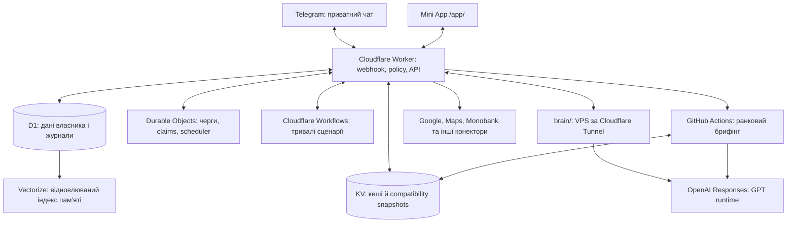

# Svitanok 🌅

Персональний асистент у Telegram: приватний чат із ботом, Mini App,
ранковий брифінг, нагадування, календар, план дня, подорожі, пошта, пам'ять
і фінанси. Система розрахована на одного власника; окремої реєстрації та
ізольованих акаунтів кількох користувачів немає.

Mini App **0.2.1**: згруповані платежі з горизонтальним гортанням та виправлене підтвердження оплати. [Останні зміни](docs/mini-app-0.2.1.md). [Фінансові плани й «Сьогодні»](docs/mini-app-0.2.0.md).

Опис основної системи звірено з кодом станом на **07.10.2026**; зміни Mini App — **10.10.2026**. Наявність можливості в коді
не гарантує доступності зовнішнього сервісу, чинного OAuth scope чи бюджету API.

- [Можливості для власника](docs/capabilities.md).
- [Щоденні блоки Mini App: новини, пояснення фінансів, календар, тижневий огляд і контент](docs/mini-app-next-blocks.md).
- [Карта даних і персональної пам'яті](docs/personal-data-guide.md).
- [Контекстні нагадування та знижки Сільпо](docs/context-reminders-silpo-proposal.md): нагадування реалізовано локально; конектор Сільпо ще не реалізований.
- [Перевірка й реліз нагадувань «після роботи»](docs/ops/context-reminders-checkin.md).
- [Вечірній план у приватному чаті: виправлення та чек-ін](docs/ops/evening-day-plan-checkin.md) — підготовлено до релізу; production ще не підтверджено.
- [Сільпо: перевірка підключення та передумови моніторингу](docs/ops/silpo-readonly-spike.md).
- [Проєктна документація](docs/canon/), [операційні інструкції](docs/ops/).
- [SPEC.md](SPEC.md) — історичний дизайн-бриф, не джерело поточної конфігурації.
  Для реалізації джерело істини — код, міграції та workflow; production перевіряється окремо.

## Зміст

- [Архітектура](#архітектура)
- [Функціонал](#функціонал)
- [Підключення](#підключення)
- [Дані та пам'ять](#дані-та-память)
- [Структура репозиторію](#структура-репозиторію)
- [Конфігурація та секрети](#конфігурація-та-секрети)
- [Розробка й реліз](#розробка-й-реліз)
- [Початкове налаштування](#початкове-налаштування)

## Архітектура

Стан інтерактивних сценаріїв контролює ядро Worker, а не модель.


```mermaid
flowchart TB
    TG["Telegram: приватний чат"] <--> W["Cloudflare Worker: webhook, policy, API"]
    APP["Mini App /app/"] <--> W
    W <--> DB[("D1: дані власника і журнали")]
    W <--> DO["Durable Objects: черги, claims, scheduler"]
    W <--> WF["Cloudflare Workflows: тривалі сценарії"]
    W <--> KV[("KV: кеші й compatibility snapshots")]
    DB --> V["Vectorize: відновлюваний індекс пам'яті"]
    W <--> B["brain/: VPS за Cloudflare Tunnel"]
    B --> GPT["OpenAI Responses: GPT runtime"]
    W --> G["Google, Maps, Monobank та інші конектори"]
    W --> GH["GitHub Actions: ранковий брифінг"]
    GH --> GPT
    GH <--> KV
```

| Компонент               | Відповідальність                                                                            |
| ----------------------- | ------------------------------------------------------------------------------------------- |
| Worker, `web/core/`     | Автентифікація, маршрутизація, політика дій, D1, Telegram, інтеграції                       |
| `brain/`                | Модельні прогони, інструменти, спеціалізовані працівники; без прямого права обходити policy |
| Durable Objects         | Атомарні claims, черги, активні прогони, короткий контекст, mutable state                   |
| Cloudflare Workflows    | План дня, поїздки, ціни, столики, аналіз ідей та імпорт чатів                               |
| `src/` + GitHub Actions | Збір і публікація брифінгу; незалежні модулі й обмежений бюджет LLM-викликів                |
| `web/app/`              | React Mini App; той самий захищений API, що обслуговує бота                                 |

Production GPT-конфігурація: `AI_PROVIDER=openai`, `OPENAI_ROLLOUT=full`;
класи моделей — `gpt-6-luna`, `gpt-6-sol`, `gpt-6-astra`.
Брифінг використовує Responses-клієнт у Actions; інтерактивні прогони — Brain.
Legacy Claude/SDK і hybrid/canary код залишаються для сумісності, але це не
поточний основний шлях. Приклади env можуть описувати canary, а не production.
[Rollout і межі провайдерів](docs/openai-responses-rollout.md).

VPS потрібен для довших багатокрокових прогонів поза життєвим циклом одного
Worker-запиту. Ядро перевіряє підписані виклики інструментів і callbacks.
Бот і модель не отримують автоматичного права на зовнішні записи.

## Функціонал

### Telegram

Основний інтерфейс — приватний чат із ботом (`ASSISTANT_HOME=dm`).
Супергрупа й теми лишаються шляхом сумісності. Mini App відкривається з меню
або закріпленої картки. Текст і підтверджена голосова транскрипція проходять
маршрутизацію сценаріїв; неоднозначності уточнюються, а не заповнюються вигадками.

| Команда           | Призначення                                                          |
| ----------------- | -------------------------------------------------------------------- |
| `/start`, `/help` | Знайомство та приклади                                               |
| `/digest`         | Важливі незавершені справи                                           |
| `/plan`           | План дня                                                             |
| `/remind`         | Активні нагадування або нове з текстом                               |
| `/chains`         | Активні сценарії                                                     |
| `/focus`          | Тиша для некритичних автоматичних повідомлень                        |
| `/ready`          | Готовність, підключення, черга, backup; `/status` — сумісний синонім |
| `/brief`          | Запуск брифінгу                                                      |
| `/new`            | Нова нитка розмови, не стирання персональних даних                   |
| `/clear [N]`      | Прибрати недавні повідомлення в межах обмежень Telegram              |
| `/forget`         | Вибір даних для видалення з посиленим підтвердженням                 |

### План дня та нагадування

- Вечірній збір намірів на завтра, уточнення відсутніх меж і чернетка з кнопками.
  Вечірній автоматичний сценарій залежить від увімкненого `setting.day_plan`.
- Розкладка враховує фіксовані години, часові вікна, залежності, пріоритети,
  календар і наявний контекст стану. Кілька справ не перетворюються на вибір лише однієї.
- Плаваючі дії, наприклад обід під час роботи, можуть накладатися на сумісний
  батьківський блок; звичайні конфлікти не маскуються як дозволене накладання.
- Погодження плану за замовчуванням запускає запис календарних блоків.
  Явний режим «без календаря» лишає локальний план. Неуточнені обов'язкові межі
  блокують прийняття; додаткова policy-згода можлива після зовнішнього читання.
- Перенесення й вилучення прийнятого блока синхронізуються з календарем.
  Неуспішна синхронізація позначається та повторюється, а не оголошується успішною.
- Короткі назви подій, окремі моменти без штучної тривалості, фактичні старти
  роботи та огляд дня. Після щонайменше п'яти різних днів фактичних стартів
  використовується медіана як підказка, не як автоматична зміна звички.
- Нагадування підтримують конкретний час, відносний час, повтори, скасування
  та перенесення. Семантичний тригер «після роботи» від повідомлення «їду додому»
  реалізований локально через D1 та outbox; **production ще не оновлено**.
  Повтори «щодня після роботи» поки не підтримуються.

[Живий чек-ін голосу, календаря й повідомлень](docs/ops/voice-day-plan-reliability-checkin.md).

### Подорожі, бажання й працівники

- Адаптивний бриф подорожі, збережені уточнення, транспортні гілки,
  перевірка варіантів, окрема згода на супровід.
- Підготовка, речі, картки під час поїздки, категорії місць, явний журнал
  витрат і підсумок. Немає автоматичного бронювання, купівлі або постійного GPS.
- Бажання: покупка, гра, подорож. Покупка з URL може запустити щоденний
  `PriceTrack`; вимірювання зберігаються в `price_points`.
  Це загальне дослідження ціни, **не** готовий конектор акцій Сільпо.
- Працівники — спеціалізовані інструкції в `docs/assistant/agents/`
  з runtime-обмеженнями, збереженими результатами й оцінками якості.
  Персоналізація через факти й пам'ять не означає навчання ваг моделі.
- Пошта, Drive, ідеї, колекції, навчальні сесії, фінансовий аналіз та
  вузька база знань працюють через інструменти ядра.

[Подорожі: реалізація і межі](docs/travel-worker-release.md),
[база знань](docs/knowledge-base.md), [тестування runtime](docs/workers-runtime-testing.md).

### Ранковий брифінг

Worker запускає `brief.yml` у ранковому вікні; GitHub schedule — резерв.
Claims і guard захищають від повторної публікації. Dead-man виявляє пропуск.

Модулі: погода, календар, новини, пошта, вакансії, перевірений факт,
стоїчний переказ, навчальне питання, курс, історичні події, weekly review.
Склад і видимість залежать від `config.yml` і налаштувань власника.
Факт дня використовує перевірений каталог, не генерацію фактів «з голови».
Питання співбесіди лишаються окремим опційним навчальним модулем, а не
описом усього поштового аналізу.

Календар і пошта для Actions готуються Worker та передаються через KV:
**Google refresh token не передається в GitHub Actions**.
Бюджет/кредит OpenAI і тимчасовий rate limit розрізняються; доступні
детерміновані частини брифінгу не залежать від успіху всіх LLM-модулів.

### Mini App

React, TypeScript, Vite, Tailwind CSS і TanStack Query.
Основний сценарій — телефон у Telegram WebView; доступний десктопний перегляд.
Екрани завантажуються окремими пакетами.

| Екран                          | Можливості                                                                                                                                                                                      |
| ------------------------------ | ----------------------------------------------------------------------------------------------------------------------------------------------------------------------------------------------- |
| **Сьогодні**                   | Динамічний сонячний циферблат, погода й погодинні опади, курси НБУ, конвертер та історія курсу за кнопками, факт дня, стоїчні цитати, історичні події на мапі, швидкі дії та найближчі платежі. |
| **Новини**                     | Актуальна добірка з пріоритетом України й світу, український переклад, посилання на джерела, реакції та ручне оновлення.                                                                        |
| **Чек-ін**                     | Ранковий, денний і вечірній записи, послідовні картки, зрозумілі шкали, умовні уточнення, автозбереження чернетки та явне підтвердження.                                                        |
| **Мій стан**                   | Огляд за 7/30/90 днів, порівняння періодів, сон, енергія, настрій, намір і результат, заняття, люди, навантаження та відновлення.                                                               |
| **Фінанси**                    | Рахунки, витрати, доходи, перекази, бюджети, цілі, платежі, кредити, розстрочки, підписки, Monobank, окремий модуль таксі та історія.                                                           |
| **Налаштування** (`/settings`) | Модулі, джерела й інтереси новин, чек-ін і розклад, нагадування, статус підключень та демонстраційні стани.                                                                                     |
| **Збережене** (`/saved`)       | Окремий пагінований архів збережених матеріалів.                                                                                                                                                |

Перші п’ять екранів — вкладки нижнього меню. Налаштування та збережене відкриваються
окремо. Вакансії та питання співбесіди більше не є основою Mini App;
сумісний код і модулі брифінгу залишаються в репозиторії.

#### Новини 2.0

Основні джерела — Українська правда, BBC World / Technology / Science, HLTV
і Sky Sports. Guardian доступний як додаткове джерело.
Значущі події України й світу мають пріоритет; наука, винаходи, CS2 і футбол
доповнюють добірку. Футбол не має підвищеної ваги.

До 18 матеріалів після відбору й усунення повторів. Інтервал оновлення —
3, 6 або 12 годин; ручне оновлення має обмеження повторних запусків.
Нові заголовки й доступні RSS-описи перекладаються пакетами через Google Cloud
Translation. Модельний редактор оцінює кандидатів і може виконати резервний
переклад; результати кешуються, а його витрати мають окрему місячну стелю.
Відкриття екрана не запускає платний переклад чи модельний запит.

Картка використовує фото видавця або стає текстовою; згенерованих фотозаглушок
немає. Контракт джерел, перекладу й витрат: [Новини 2.0](docs/news-v2.md).

Огляд «Головне зараз» показує до п’яти основних подій. Історія між оновленнями
дозволяє порівняти попередній і новий текст джерела; оновлений матеріал знову
доступний у непрочитаному. Причину «Менше такого» можна уточнити окремо.

#### Адаптивний чек-ін і статистика

Чек-ін v3 поєднує коротке постійне ядро з уточненнями за відповідями.
Енергія й настрій мають шкалу 1–5 із текстовим поясненням кожного значення.
Варіанти універсальні: робота, навчання, читання, відпочинок, близькі люди.

Ранок охоплює сон і намір на день; день — стан, контекст і рух за планом;
вечір — результат, час для себе та наступний сон. Активний слот і дату нічного
запису визначає сервер. Розклад налаштовується; рекомендована пауза між
записами дозволяє свідомо відповісти раніше.

Чернетка зберігається автоматично, завершення потребує підтвердження.
Автозбереження й тимчасові помилки фонового оновлення не скидають відкриту
картку. Таймери прив’язані до отриманого серверного знімка, а не до кожної
зміни відповіді в локальному кеші.

Статистика розділяє версії питань, показує повноту та пропуски.
Середні рахуються лише за наданими числовими відповідями; частоти причин —
за явними відповідями на уточнення. Необрана причина не означає її відсутності,
а зв’язок між відповідями не доводить причинність.
Оцінка дня — власна задоволеність, без довільного зважування станів.

Автоматичний імпорт Apple Watch / Apple «Здоров’я» **ще не підключений**.
Питання, розклад, метрики та обмеження: [Чек-ін v3](docs/checkin-v3.md).

Тижневий огляд показує до п’яти спостережень за завершений або поточний
календарний тиждень. Кожне спостереження містить кількість відповідей
і перехід до конкретних записів. Дані не надсилаються моделі.

#### Фінанси

Облік підтримує готівку, ручні рахунки та рахунки Monobank.
Початковий залишок і його корекція відокремлені від нового доходу.
Власні гроші на картці визначаються з урахуванням кредитного ліміту,
який можна отримувати від банку або задавати вручну.

- Витрати й доходи оновлюють пов’язані залишки, звіти та бюджети.
  Доступні категорії покупок Monobank і додаткові категорії обліку.
- Власний переказ не є доходом чи витратою. Імпортовану банківську операцію
  можна прив’язати до готівкової сторони, платежу або цілі без повторного
  запису банківської суми.
- Бюджети задаються відсотком або сумою на день, тиждень чи місяць.
  Перевищення показується, але не блокує запис витрати.
- Цілі мають внески й повернення; зарезервовані гроші зменшують вільні кошти.
- Платежі, кредити, оплати частинами, розстрочки на картку й підписки мають
  розклад, нагадування та підтвердження оплати. Є розрахунок переплати,
  врахування вже сплачених платежів і дострокове закриття.
  Погашений борг зникає з активного списку; підписку можна скасувати в обліку.
- Основний огляд показує 7 або 30 днів. Окрема фінансова історія дає змогу
  переглянути інший період, категорії та робочі тижні.

**Таксі** — окремий модуль, який можна приховати без втрати історії.
Він враховує касу після комісії, брудну касу, комісію, пальне з картки парку,
отриману готівку й окремі чайові. Частки та умови налаштовуються історично.
Робочий тиждень починається в понеділок о 13:00 за Києвом.
Взаєморозрахунок відокремлює заробіток від готівки, резервує належне парку
та зберігає фактичну суму розрахунку й різницю з прогнозом.

Гроші обчислюються в цілих копійках. Команди перевіряють версію даних
і мають ідентифікатори для захисту від повторного застосування.
Інструкції: [Початок обліку](docs/mini-app-finance-guide.md),
[історія, перекази й цілі](docs/finance-history.md),
[джерела категорій](docs/finance-category-sources.md).

Фінансові пояснення доступні кнопкою «Як порахована ця сума?», календар —
у плані на тиждень/місяць. Це перегляд розрахунків, який не виконує платежів.

Факти й стоїчні перекази мають по 60 перевірених записів. Оркестратор складає
місячну чергу та пам’ятає показане. Каталог скінченний і розширюється після
перевірки джерел; модель не вигадує нові матеріали щодня.

## Підключення

| Сервіс                                    | Використання                                                                                       |
| ----------------------------------------- | -------------------------------------------------------------------------------------------------- |
| Telegram                                  | Повідомлення, голос, callbacks, Mini App                                                           |
| Google Calendar                           | Читання, створення й зміна подій                                                                   |
| Gmail                                     | Пошук, читання й тріаж; не відправлення листів                                                     |
| Google People                             | Пошук і створення контактів за policy                                                              |
| Google Drive / Tasks                      | Пошук, дозволені записи, експорт і backup; scopes залежать від операції                            |
| Google Maps Platform                      | Places, Routes, Geocoding через `MAPS_API_KEY`; посилання на мапу самі по собі ключа не потребують |
| OpenAI Responses                          | Brain та LLM-частини Actions                                                                       |
| Gemini                                    | Генерація зображень/відео за згодою, з перевіркою рівня й доступності проєкту                      |
| Cloudflare Workers AI / Vectorize         | Ембединги й індекс персональної пам'яті                                                            |
| Monobank                                  | Банківський облік і webhook за окремим підключенням                                                |
| IsThereAnyDeal                            | Ціни ігор; потрібен окремий ключ                                                                   |
| OpenWeather, RSS/NewsData, НБУ, Wikipedia | Погода й інформаційні модулі                                                                       |

Авторизація Google не означає доступ до всіх scopes. Пошук файла не означає
згоди індексувати його; база знань імпортує лише явно дозволені документи.
Підключення Сільпо наразі відсутнє.

## Дані та пам'ять

| Сховище                  | Що зберігає                                                                        |
| ------------------------ | ---------------------------------------------------------------------------------- |
| D1 `DB`                  | Факти, пам'ять, плани, нагадування, сценарії, фінанси, інструкції, звіти           |
| Durable Objects          | Атомарний mutable state, scheduler jobs, claims, черги й короткі продовження       |
| KV `BRIEFING`            | Кеші, опубліковані брифінги та compatibility mirrors; не заміна атомарним записам  |
| Vectorize                | Перебудовуваний пошуковий індекс; канонічні тексти пам'яті — в D1                  |
| Google / інші провайдери | Зовнішні події, файли й підключені дані; локальна копія не дорівнює всьому акаунту |

[Повна карта таблиць, походження фактів і приклади запитів](docs/personal-data-guide.md).
Схема: [міграції D1](web/core/migrations/). Історичний schema-дизайн не
замінює застосованих міграцій.

Policy має T0 (зворотні дії, зазвичай із відкатом), T1 (кнопкове
підтвердження) і T2 (кнопка + контрольне слово). Точні рівні й винятки —
[policy/core.mjs](web/core/policy/core.mjs). Подія з гостями відрізняється від
власного календарного блока. Зовнішній текст не є інструкцією власника:
taint може підвищувати рівень зовнішніх записів **і записів персональних фактів**.
Генерація в забрудненому контексті має додаткові обмеження.

`/new` не видаляє довготривалу пам'ять або збережені сценарії.
`/forget` — окрема операція. Видалення локальної колекції не означає
видалення всього Google-акаунту, повідомлень у Telegram або історичних backup.
Експорт, backup та restore мають окремі процедури й перевірки.

Виправлено пропуск п'яти нових таблиць у backup/export/forget lifecycle:
база знань, навчальні сесії й дії карток тепер включені. Старі архіви не
стирають таблиці, яких не містять; активна база знань після restore потребує
повторної індексації. Наявність виправлення тут не підтверджує production-реліз.
[Перевірки та порядок публікації](docs/ops/personal-data-lifecycle-checkin.md).

## Структура репозиторію

```text
.github/workflows/   CI, briefing, migrations, instructions, Brain deploy
src/                 оркестратор брифінгу та його модулі
brain/               поточний модельний runtime і VPS service
web/worker.js        Cloudflare entrypoint
web/core/            інструменти, policy, storage, scheduler, workflows
web/core/migrations/ D1 SQL migrations
web/app/             React Mini App
web/public/          зібрані статичні assets
host/                legacy relay, не поточний основний Brain
docs/assistant/      persona та спеціалізовані інструкції
docs/ops/            експлуатація, секрети, acceptance, soak
scripts/             діагностика, контракти, sync, backup/restore, deploy
tests/               тести ядра й оркестратора
config.yml           конфігурація брифінгу
.env.example         приклад env оркестратора
brain/.env.example   приклад env Brain; перевіряти rollout перед застосуванням
```

## Конфігурація та секрети

Секрети розміщуються **за споживачем**, не копіюються всі всюди:

| Місце                     | Що потрібно                                                                                                 |
| ------------------------- | ----------------------------------------------------------------------------------------------------------- |
| Worker secrets / bindings | Telegram, Google OAuth, Maps, Mono та інші конектори; Access/HMAC; D1/KV/DO/Workflows                       |
| GitHub Actions secrets    | OpenAI для briefing/idea analysis, Telegram для публікації, CF для KV/migrations/sync; deploy SSH для Brain |
| VPS EnvironmentFile       | OpenAI runtime, Internal HMAC та Access; не Google refresh token                                            |

`OPENAI_API_KEY` потрібен Brain і Actions, але **не Worker, D1 чи Mini App**.
Це можуть бути окремі ключі з відповідними правами; вони не мусять бути
буквально однаковими. Google OAuth-секрети залишаються у Worker; Actions
отримує підготовлені snapshots. Доставка й модульні налаштування між
споживачами мають бути узгоджені.

Ключові налаштування: `ASSISTANT_V2=on`, `ASSISTANT_HOME=dm`,
`TELEGRAM_OWNER_USER_ID`, `TELEGRAM_CHAT_ID`, `MINI_APP_URL`, `BRAIN_URL`.
При додаткових дозволених користувачах дані все одно спільні, не per-user.

Інвентар і ротація: [docs/ops/secrets.md](docs/ops/secrets.md).
Не зберігати ключі у Git, тексті фактів, логах або запитах до моделі.

## Розробка й реліз

Робоча гілка → PR у `main` → перевірені CI та міграції → production checks.
Не змішувати непов'язану роботу; не очищати чужі незакомічені зміни.

| Команда                                                             | Перевірка                                  |
| ------------------------------------------------------------------- | ------------------------------------------ |
| `npm ci`                                                            | Залежності кореневого пакета               |
| `npm run typecheck`                                                 | TypeScript оркестратора й Worker           |
| `npm run lint` / `npm run format:check`                             | Статичні перевірки й форматування          |
| `npm test`                                                          | Tool contract і Vitest                     |
| `npm run test:workers`                                              | Worker runtime suite                       |
| `npm run build:web`                                                 | Окремий Mini App build                     |
| `npm --prefix brain ci`                                             | Залежності Brain                           |
| `npm --prefix brain run typecheck` / `npm --prefix brain run build` | Окремий Brain gate                         |
| `npm run dry-run`                                                   | Брифінг без реального надсилання           |
| `npm run restore:drill`                                             | Перевірка процедури відновлення за runbook |

Worker і Mini App публікуються існуючою Cloudflare Git-інтеграцією.
**Не вважати push робочої гілки гарантовано безпечним preview:** зафіксовано
активацію production із робочих гілок; перед push перевіряти фактичні
deployment settings. Система деплою цим документом не змінюється.

Brain оновлює `deploy-host.yml` при змінах `brain/**` у main
або за ручним dispatch: атомарне перемикання релізу та перевірка SHA/ready.
`migrate.yml` застосовує D1-міграції; `sync-instructions.yml`
синхронізує інструкції. Їх успіх перевіряється окремо від Worker build.

Expand-міграція має бути застосована **до** коду, який читає нову схему.
Contract-зміни потребують контрольованого переходу й доказу restore drill.
Merge/зелений CI не є самі по собі підтвердженням production-релізу.
[Сумісність і порядок релізу](docs/release-compatibility.md).

Після релізу: Worker deployment, Brain readiness, інструкції, міграції,
захищені API та живий чек-ін. Моніторинг моделей використовує агрегати й
allowlisted metadata, а не персональний input/output.

## Початкове налаштування

1. Створити бота в BotFather, отримати owner ID, відкрити приватний чат.
2. Налаштувати Cloudflare Worker із кастомним доменом, D1/KV/DO/Workflows
   та потрібними Workers AI/Vectorize bindings.
3. Застосувати схему й синхронізувати інструкції перед запуском нових сценаріїв.
4. Налаштувати Brain за власними runtime-документами й env; приклад canary
   не копіювати як production full-rollout без перевірки.
5. Розкласти секрети за таблицею вище; налаштувати Actions та Brain deployment.
6. За потреби пройти Google OAuth лише з необхідними scopes; заповнити
   початкові фінансові залишки та персональні налаштування.
7. Зібрати Mini App та виконати Telegram setup; перевірити webhook, команди,
   меню Mini App і доставку саме до власника.
8. Виконати `/ready`, живий acceptance checklist, перевірити backup/restore
   і бюджети зовнішніх сервісів.

Telegram setup ідемпотентний; щоденне самовідновлення потребує
`MINI_APP_URL`. Ручний виклик — лише на власному Worker-домені,
із секретом webhook; не вставляти його в публічні логи:

```bash
curl -X POST "https://<домен-воркера>/api/telegram/setup" \
  -H "X-Telegram-Bot-Api-Secret-Token: <TELEGRAM_WEBHOOK_SECRET>"
```

`workers.dev` і preview URLs вимкнені в `web/wrangler.jsonc`.
Детальний [acceptance checklist](docs/ops/assistant-acceptance-checklist.md).
