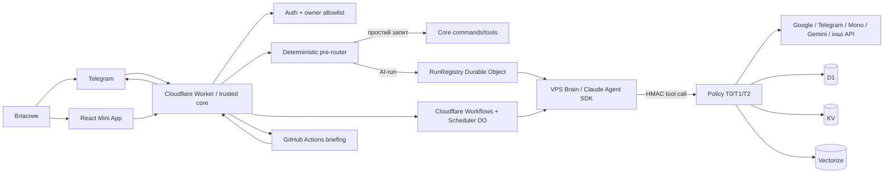
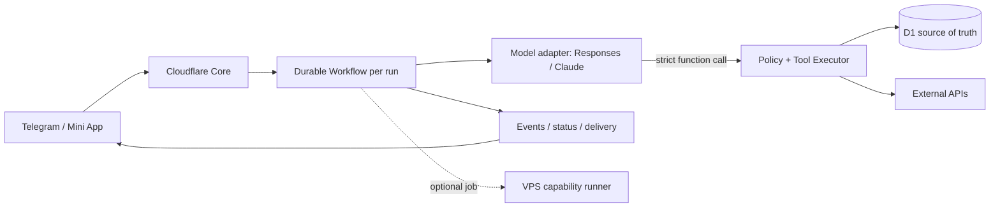

# Svitanok: незалежний технічний і продуктовий аудит

**Дата:** 16 вересня 2026  
**Статус:** аудит репозиторію; без змін production-коду  
**Основне джерело правди:** фактична поведінка коду, перевірена разом із документацією та тестами

## 1. Підсумковий висновок

Svitanok уже не є «ботом із командами». Це доволі зріла персональна система з окремим довіреним ядром, AI-мозком, планувальником, пам'яттю, кількома сховищами, фоновими процесами, Mini App і великим набором інтеграцій. Найсильніше архітектурне рішення проєкту — модель не має бути остаточним авторитетом для дій. Намір і вибір інструмента можуть бути ймовірнісними; авторизація, policy, ідемпотентність і фактичний запис мають залишатися детермінованими.

Моя чесна рекомендація — **не переписувати систему і не починати з міграції Claude → GPT**. Спершу треба стабілізувати контрольний контур і дані. У репозиторії є кілька високих ризиків, через які AI-run може зависнути, паралельні записи можуть втратити стан, зовнішній контент може забруднити довгострокову пам'ять, а «забути все» не охоплює всі копії даних. Додавання нових агентних можливостей до виправлення цих місць збільшить не корисність, а площу відмов.

Цільовий напрямок:

1. **Cloudflare залишається довіреним control/data plane**: Telegram, Mini App auth, policy, tools, D1, Durable Objects, Workflows, аудит і підтвердження.
2. **AI-runtime стає provider-neutral**: єдиний контракт інструментів і профілів, адаптери OpenAI/Claude, однакова policy-поведінка незалежно від моделі.
3. **OpenAI Responses API спочатку працює у shadow/eval-режимі**, а не одразу замінює production-мозок.
4. **VPS є перехідним компонентом, а не обов'язковим центром майбутньої системи**. Після стабілізації короткі та довгі AI-run можна оркеструвати Cloudflare Workflows/Queues і напряму викликати API. VPS варто залишити лише для можливостей, яким справді потрібні ОС, локальні файли або приватний обчислювальний контур.
5. **Svitanok має бути не універсальним автономним агентом, а персональним операційним шаром**: показати важливе, допомогти вирішити, пам'ятати обґрунтування, безпечно виконати підтверджену дію і пояснити, що сталося.

## 2. Межі й метод аудиту

Перевірено:

- `web/worker.js`, pre-router, internal API, policy, tools, Run Registry, scheduler, Workflows, KV/D1/Vectorize;
- `brain/`: HTTP-server, Claude Agent SDK, профілі, MCP-tools, доставка результатів, graceful shutdown;
- `src/`: ранковий брифінг, модулі, GitHub Actions orchestration, jobs scoring;
- `web/app/`: маршрути, API-client, auth/error paths, accessibility, production bundle;
- Google/Telegram/Mono/Gemini/Deepgram та інші інтеграційні межі;
- схеми, міграції, backup/restore, CI/CD і canonical docs;
- тестову базу, coverage і dependency audit.

Виконані перевірки:

- root: **184 test files, 4 268 tests — passed**;
- Mini App: **12 files, 143 tests — passed**;
- root typecheck, lint, format check — passed;
- brain і Mini App typecheck — passed;
- Mini App lint — passed;
- production builds brain і Mini App — passed;
- root coverage: statements **89.23%**, branches **81.14%**, functions **88.24%**, lines **91.38%**;
- production dependency audit: root і Mini App — 0 відомих vulnerabilities; brain — 1 moderate transitive issue в `qs` через Claude Agent SDK/MCP/Express. У dev-залежностях root є 5, Mini App — 2 відомі проблеми, переважно в Vitest toolchain.

Обмеження: це глибокий аудит репозиторію, а не live-аудит акаунтів. Я не перевіряв реальні Cloudflare/GitHub/VPS logs, remote D1, секрети, Access policy, Google consent screen, фактичні витрати, Telegram-клієнти на пристроях або успішність останнього restore drill. Тому операційні твердження, які залежать від production-стану, нижче позначені як такі, що треба підтвердити.

## 3. Як система реально працює

Є фактично чотири підсистеми:

1. **Cloudflare core (`web/`)** — довірена межа. Приймає Telegram webhook і Mini App API, перевіряє користувача, зберігає стан, виконує tools, застосовує policy, керує чергами run і фоновими сценаріями.
2. **Brain (`brain/`)** — локальний Node.js-сервіс на VPS за Cloudflare Tunnel. Він використовує Claude Agent SDK, отримує інструкцію від core, викликає лише підписані internal endpoints і повертає відповідь/телеметрію.
3. **Briefing orchestrator (`src/`)** — окремий production-контур у GitHub Actions. Cloudflare запускає його в потрібний час, а GitHub schedule є fallback. Частина модулів детермінована, частина проходить LLM-curation.
4. **Mini App (`web/app/`)** — React SPA для огляду дня, новин, вакансій, статистики, збереженого і налаштувань.

### Життєвий цикл звичайного AI-запиту

1. Worker валідує Telegram secret, owner ID і duplicate update.
2. Pre-router вирішує, чи можна відповісти детерміновано, чи потрібен quick/chat profile.
3. RunRegistry серіалізує запити в межах thread і обмежує чергу.
4. Worker підписує запит до brain; brain повертає `202` і продовжує роботу у фоні.
5. Brain викликає core tools через HMAC + timestamp + nonce + run ID.
6. Policy визначає T0/T1/T2; небезпечна дія перетворюється на proposal і потребує підтвердження.
7. Brain доставляє результат у Telegram і окремо надсилає run report.
8. Core зберігає `runs/run_steps`, закриває RunRegistry і запускає наступний queued run.

Цей восьмий крок зараз є одним із головних слабких місць: telemetry і керування чергою помилково з'єднані в один best-effort виклик.

### Стан і дані

- **D1**: структуровані персональні дані, факти, сесії, пропозиції, reminders, analytics, runs, workflow state тощо.
- **KV**: briefing/cache/config і частина mutable JSON state. Для кешу KV доречний; для конкурентно змінюваного стану — ні.
- **Durable Objects**: серіалізація run, планування, run registry.
- **Vectorize**: похідний семантичний індекс memory chunks.
- **VPS filesystem / SDK transcripts**: сирі AI-сесії, які документація обіцяє зберігати 90 днів.
- **Google Drive backup**: щотижнева зашифрована копія D1/KV.

## 4. Що зроблено добре

### 4.1. Межа довіри сформована правильно

Найкраща частина Svitanok — розподіл ролей: модель інтерпретує, а ядро дозволяє й виконує. Це треба зберегти при будь-якому переході на OpenAI. Видавати Responses API прямі Google credentials або право обійти T0/T1/T2 було б регресією.

### 4.2. Автентифікація й внутрішні API загалом сильні

- Telegram webhook має secret і owner allowlist.
- Mini App перевіряє `initData` через HMAC, freshness і constant-time compare; write-доступ відокремлено від co-owner read.
- Internal API використовує HMAC, method/path/body binding, timestamp, run ID і одноразовий nonce.
- Google refresh token залишається в Worker; access token кешується і не потрапляє в backup/export.
- Mono webhook не довіряє лише URL-secret: є перевірка account/reconciliation.
- Вхідні body мають обмеження; critical paths fail closed при відсутніх secrets/IDs.

Це відповідає офіційній моделі перевірки Telegram Mini Apps: `initData` треба перевіряти на сервері, а `initDataUnsafe` не можна вважати довіреним ([Telegram Mini Apps](https://core.telegram.org/bots/webapps)).

### 4.3. Критична логіка здебільшого детермінована

Нагадування, auth, policy, календарні дії, дедуплікація, дані брифінгу і підтвердження не покладені виключно на LLM. Це правильний принцип для персонального асистента.

### 4.4. Є реальна defense-in-depth робота з prompt injection

Зовнішні результати обгортаються як external content, сесія отримує taint, є proposals і підтвердження. Підсумки формуються лише з нетainted-сесій, що запобігає простому «відмиванню» листа або вебсторінки в довгострокову пам'ять. Проблема не в задумі, а в неповному покритті policy, описаному нижче.

### 4.5. Backup-стратегія краща за типову для персонального проєкту

Є шифрований off-platform backup, хеш перевірки й нагадування про restore. Додатково D1 Time Travel уже дає point-in-time recovery: відновлення до хвилини, до 30 днів на paid і 7 днів на free plan ([Cloudflare D1 Time Travel](https://developers.cloudflare.com/d1/reference/time-travel/)). Оптимальна схема — Time Travel для швидкого recovery плюс Drive backup для довшого горизонту і незалежності від провайдера.

### 4.6. Тести й UX-дисципліна вже на високому рівні

Кількість тестів не є самоціллю, але 4 411 passing tests, типізація, lint, formatting і production builds створюють хорошу базу для рефакторингу. Mini App має reduced motion, safe areas, ARIA, focus management, error boundaries і зрозумілу нижню навігацію. Це треба еволюціонувати, а не замінювати.

## 5. Ключові проблеми й ризики

Шкала:

- **S1 — високий:** виправити до розширення агентних можливостей;
- **S2 — середній:** включити в найближчий цикл стабілізації;
- **S3 — низький:** оптимізація або технічний борг.

### S1-1. Завершення run є best-effort, хоча це control plane

**Де:** `web/core/run-registry/client.mjs`, `brain/src/core-client.ts`, `web/core/internal/router.mjs`.

`registryBegin()` і `registryFinish()` ковтають помилки. При цьому internal tools приймаються лише для активного run. Якщо `begin` не записався, brain уже стартував, але всі tool calls отримають `run-unknown`. У зворотному напрямку `reportRuns()` у brain також best-effort, хоча core саме в цьому endpoint:

- пише `run_steps`;
- завершує registry;
- просуває thread queue;
- переносить quick → chat escalation;
- завершує або продовжує workflow chain.

Додатково `handleRuns` спершу послідовно пише telemetry і лише потім закриває registry. Одна помилка D1 повертає `500`, черга не просувається, а brain не робить гарантованого retry. Повторний запит, навпаки, може дублювати `run_steps`, бо немає унікальності `(run_id, n)`.

**Наслідок:** завислий thread приблизно до stale sweep, втрачене продовження workflow, повторна відповідь або silent failure.

**Що зробити:**

1. Розділити **authoritative completion** і telemetry.
2. `POST /internal/runs/{id}/complete` зробити ідемпотентним state transition із dedupe key; завершення registry не повинно залежати від insert кожного step.
3. Додати retry з exponential backoff і durable outbox у brain або, краще, перенести життєвий цикл у Workflow/Queue.
4. Додати unique constraint на `(run_id, n)` і upsert/ignore для telemetry.
5. `begin` має або успішно зареєструвати run, або не запускати brain.

Cloudflare Queues гарантує at-least-once delivery, отже consumer усе одно має бути ідемпотентним ([Queues delivery guarantees](https://developers.cloudflare.com/queues/reference/delivery-guarantees/)). Це добра властивість для майбутнього контуру, але не заміна idempotency.

### S1-2. Mutable JSON у KV може втрачати паралельні записи

**Де:** `web/kv-store.mjs`, ключі на кшталт загального `state`/`stats`; writers у webhook, scheduler і GitHub Actions.

`updateJson()` читає значення, будує patch, перечитує і за потреби перебудовує patch. Це зменшує вікно гонки, але не є compare-and-swap. Два writers усе одно можуть прочитати однакову версію і перезаписати зміни одне одного. KV також має eventual consistency і ліміт запису в один ключ; офіційна документація прямо попереджає, що concurrent writes overwrite one another і що KV не підходить для atomic read-modify-write ([Workers KV writes](https://developers.cloudflare.com/kv/api/write-key-value-pairs/), [KV consistency](https://developers.cloudflare.com/kv/concepts/how-kv-works/)).

**Наслідок:** рідкісна, важко відтворювана втрата check-in/stat/settings state саме під час паралельних подій.

**Що зробити:** структуровані mutable дані перенести в D1 transactions/event tables або серіалізувати всі записи через один Durable Object. KV залишити для latest briefing, immutable snapshots, cache і конфігурації.

### S1-3. `facts.set` може понизити якість підтвердженого факту

**Де:** `web/core/tools/facts.mjs`, `web/core/policy/core.mjs`.

Upsert безумовно замінює `value` і `source`. Тому model-inferred T0 fact здатний перезаписати owner-confirmed fact і змінити `source=owner` на `source=inferred`. Водночас `facts.set` не входить до всіх taint-escalated writes. Отже зовнішній лист/сайт може вплинути на стійку пам'ять без явного підтвердження — не через повний обхід policy engine, а через прогалину в матриці дій.

**Наслідок:** memory poisoning, неправильні персональні рішення, втрата довіри; помилка може жити довше за вихідний контекст.

**Що зробити:**

- заборонити inferred update поверх owner value без proposal;
- зберігати provenance, confidence, `observed_at`, `supersedes`, TTL/review date;
- будь-який persistent write, породжений tainted content, переводити щонайменше в T1;
- розділити owner assertions, observed events та model hypotheses;
- додати «журнал пам'яті»: що додано, чому, з якого джерела, як видалити.

### S1-4. «Забути все» не охоплює всі копії

**Де:** canonical schema/retention docs, `brain/`, forget handlers, backup flow.

Core очищає D1/KV/FTS/Vectorize-стан, але в коді brain немає підтвердженої 90-денної cleanup-політики для сирих SDK transcripts. Також історичні зашифровані Drive backups не видаляються або не tombstone-яться. Кнопка/команда з семантикою «забути все» тому сильніша за реальну гарантію.

**Наслідок:** privacy contract не відповідає фактичній retention; користувач може вважати дані видаленими, коли копії залишилися.

**Що зробити:** створити data inventory і deletion manifest. T2 forget повинен формувати durable deletion job для D1, KV, Vectorize, VPS transcripts, queued payloads і backup policy; результат — перевірний receipt зі списком видаленого та винятків. Для immutable backup слід чітко вказати retention і зробити crypto-erasure через ротацію per-backup/per-period keys або контрольований purge.

### S1-5. Деплой коду, D1-схеми та AI-інструкцій не атомарний

**Де:** `.github/workflows/migrate.yml`, Cloudflare Git integration, `sync-instructions.yml`, `deploy-host.yml`.

У workflow прямо зафіксовано, що порядок Worker deploy і D1 migrations best-effort. Новий код може з'явитися раніше за потрібну схему. Інструкції синхронізуються окремо, тож code/tool contract і prompt version також можуть розійтися. Brain деплоїться в той самий `/opt/svitanok-brain`, де ще працює старий процес, а потім сервіс перезапускається.

**Наслідок:** production-only середовище має вікно несумісності без надійного rollback; активний run може померти під час заміни файлів або `node_modules`.

**Що зробити:** єдиний release pipeline: CI → expand-compatible migration → versioned instructions → immutable brain release directory → readiness check → Worker deploy → smoke/canary → release marker. Destructive schema change — лише окремою contract-фазою після сумісного періоду. Brain має запускатися з versioned release і перемикатися atomic symlink.

### S2-1. D1 і Vectorize оновлюються неатомарно

**Де:** `web/core/memory.mjs`.

Поточна послідовність отримує embeddings, видаляє старі vectors, змінює D1, а потім upsert-ить нові vectors. Відмова між кроками залишає D1 pointer без vector або старий D1 row із уже видаленим vector.

**Рекомендація:** D1 є source of truth; Vectorize — rebuildable projection. Спочатку versioned D1 rows зі станом `pending`, потім upsert vectors, потім `ready`; стару версію видаляти після успіху. Додати reconciliation job і метрику orphan/missing vectors.

### S2-2. Graceful shutdown коротший за дозволений run

**Де:** `brain/src/index.ts`, `brain/src/profiles.ts`, `brain/src/server.ts`.

SIGTERM чекає близько 85 секунд, тоді як chat timeout — близько 4 хвилин, weekly — 6, price-check — 8. `/health` не показує active runs/readiness для drain.

**Наслідок:** звичайний deploy може обірвати валідний run і залишити core чекати stale timeout.

**Рекомендація:** readiness=false перед drain; припинити прийом нових run; чекати до верхньої межі або checkpoint/cancel; показувати `active_runs`, `oldest_run_age`, version. Це особливо важливо до перенесення orchestration у durable Workflow.

### S2-3. `/status` може сказати, що brain працює, коли це не так

**Де:** `web/core/prerouter.mjs`.

Статус обчислює `brainOk` з наявності expected git SHA, а не з live health state. Окремо scheduler продовжує перевіряти legacy host навіть в assistant `on` mode.

**Рекомендація:** розділити `configured`, `reachable`, `ready`, `degraded`, `version_match`, `last_successful_run`; показувати timestamp і не перетворювати «маємо очікувану версію» на «сервіс здоровий».

### S2-4. Документація й код розійшлися в безпекових контрактах

Canonical docs кажуть, що taint підвищує будь-який T0 write; код використовує whitelist. Документація описує prompt із geo + compact facts + summary; фактичний prompt brain містить лише інструкцію, Kyiv time і summary, а facts/geo треба окремо викликати tool. Також у docs п'ять Workflows, у конфігурації шість; опис старого host і scheduler не відповідає актуальному стану.

**Наслідок:** review і майбутні зміни спираються на хибний security model. Для security-sensitive системи stale canonical docs — не косметика.

**Рекомендація:** генерувати tool/policy matrix і schema docs із коду; додати contract tests «документована дія → фактичний level»; у кожному ADR фіксувати superseded status.

### S2-5. Legacy host збільшує attack і maintenance surface

`host/`, старі agent endpoints, health checks і `/api/agent-step` залишилися після переходу на новий brain. Це дає rollback, але постійний dual path ускладнює діагностику й secrets inventory.

**Рекомендація:** після production soak і tagged rollback release видалити старий host/endpoint/secrets/monitoring. **Не видаляти `src/`**, бо він досі виконує production briefing.

### S2-6. Mini App показує вигадані персональні дані при auth failure

**Де:** `web/app/src/api/client.ts`, `web/app/src/lib/demoBadge.ts`.

На `401/403` клієнт повертає `SAMPLE_STATS`/`SAMPLE_BRIEF`; маленька позначка «не твої дані» формально чесна, але UX семантично небезпечний. На персональному dashboard auth failure не повинен виглядати як справжній стан.

**Рекомендація:** блокуючий session-expired/error state з кнопкою «відкрити з Telegram» і технічним correlation ID. Demo mode має бути окремим явним маршрутом, ніколи автоматичним fallback у Telegram.

### S2-7. Поточний job fit score має хибну точність

**Де:** `src/modules/jobs.ts`.

LLM оцінює 0–100 переважно з title, статичного профілю та liked/disliked preferences. Повний опис і вимоги вакансії не є надійною основою prompt. Число на кшталт 92% тому виглядає як candidate fit, але фактично є title relevance.

**Рекомендація:** або перейменувати на «пріоритет/релевантність», або спочатку отримувати повний description і рахувати окремі виміри: stack, level, location, мова, salary, dealbreakers, evidence, missing skills і confidence. Підсумковий score не повинен приховувати невідомі дані.

### S2-8. Високе загальне coverage маскує слабкі critical files

Серед прикладів: `host/server.mjs` — 0%, `src/core/llm.ts` — близько 23%, `src/orchestrator.ts` — близько 49%, scheduler tasks — близько 46%. Unit tests імпортують модулі зі stub для `cloudflare:workers`; вони не перевіряють реальні семантики DO alarms, concurrency, Workflows, `waitUntil`, D1 і assets.

**Рекомендація:** не гнатися за новим глобальним відсотком. Додати:

- workerd/Miniflare integration suite;
- fault injection між `run complete`, D1 telemetry і queue advance;
- concurrency test для кожного mutable state;
- duplicate webhook/tool/completion replay;
- backup → clean DB → restore → semantic comparison;
- E2E з fake Telegram/Google servers;
- versioned AI eval set із redacted реальними сценаріями.

### S3-1. Mini App bundle завеликий для Telegram WebView

Production JS — приблизно 787 KB minified / 243 KB gzip, а основні screens імпортуються статично. Рекомендація: route-level `React.lazy`, vendor chunking, bundle budget у CI, dev/sample code поза live path. Великий settlements asset уже завантажується ліниво — це хороший приклад.

### S3-2. Планувальник опитує забагато self-gated задач

Scheduler DO має близько 26 registrations; частина прокидається кожні п'ять хвилин і сама перевіряє годину/день. Це працює, але погіршує observability і створює зайві виклики.

**Рекомендація:** реєстр повинен зберігати справжній `next_due_at`; один alarm витягує лише due tasks, після виконання обчислює наступний запуск.

### S3-3. Dependency hygiene потребує завершення

Production root/app чисті за audit. Brain має одну moderate transitive проблему в `qs`; dev toolchains мають відомі issues. Не варто запускати сліпий `npm audit fix`: оновити lock/SDK контрольовано, переглянути diff, повторити повний CI і smoke.

## 6. Безпека і приватність: цільова модель

### Що залишити

- Core як єдиний виконавець зовнішніх writes.
- T0/T1/T2 і explicit confirmation.
- HMAC + nonce + run binding для internal calls.
- Server-side Telegram auth; co-owner read/primary-owner write.
- External-content tagging і taint.
- Least-privilege Google scopes, token тільки в core.
- Audit trail `who/what/why/source/run/policy decision`.

### Що змінити

Taint має бути не session boolean із винятками, а властивістю **походження аргументів**. Кожен tool argument повинен знати, чи він походить від власника, core data, зовнішньої пошти/web або model inference. Policy тоді застосовує правила до data flow, а не лише до стану всього thread.

Практична матриця:

| Походження           |       Read | Тимчасовий аналіз |    Persistent local write |       External write |
| -------------------- | ---------: | ----------------: | ------------------------: | -------------------: |
| Власник              |         T0 |                T0 |            T0/T1 за типом |                T1/T2 |
| Перевірені core data |         T0 |                T0 |                     T0/T1 |                T1/T2 |
| Email/web/document   | T0 + taint |                T0 |                мінімум T1 | мінімум T1, часто T2 |
| Model hypothesis     |         T0 |                T0 | окремий hypothesis або T1 |                T1/T2 |

Для OpenAI варто явно встановлювати `store: false`, якщо Svitanok продовжує сам керувати історією та пам'яттю. Responses за замовчуванням можуть зберігатися; provider-managed conversation state не слід вмикати неявно для персональних даних ([Create a response](https://developers.openai.com/api/reference/cli/resources/responses/methods/create)).

## 7. Майбутня AI-архітектура

### Варіант A — залишити Claude brain на VPS

**Переваги:** найменше змін; працюючі SDK sessions/subagents; локальний контроль; простий rollback.  
**Недоліки:** ще один сервер, deploy/drain, human-oriented CLI/SDK semantics, окреме сховище transcripts, складний control loop.  
**Вердикт:** прийнятний короткостроково, слабкий як остаточна платформа.

### Варіант B — provider-neutral brain на VPS

Виділити `BrainEngine`/`ModelRuntime`, єдиний `ToolSpec`, адаптери Claude та OpenAI Responses. Запускати OpenAI shadow або на частці безпечних read-only запитів.

**Переваги:** найкращий міграційний міст; A/B на однакових inputs/tools; швидкий rollback.  
**Недоліки:** VPS і split orchestration залишаються; є ризик надовго законсервувати проміжний шар.  
**Вердикт:** рекомендований перехідний етап.

### Варіант C — durable orchestration у Cloudflare, model API напряму

Cloudflare Workflows зберігає стан, повторює кроки, підтримує waits/events і observability ([Cloudflare Workflows](https://developers.cloudflare.com/workflows/), [events and parameters](https://developers.cloudflare.com/workflows/build/events-and-parameters/)).

**Переваги:** менше компонентів; durable retry/status/cancel; один security/deploy plane; немає постійного LLM-host.  
**Недоліки:** треба перепроєктувати sessions, streaming, tool loop і rate limits; vendor coupling до Cloudflare orchestration; runtime limits треба перевірити prototype-ом.  
**Вердикт:** найкращий цільовий стан для стандартних run після стабілізації. VPS лишається optional capability runner, а не обов'язковий hop.

### Рекомендація: B → C, не A → big bang

Спершу provider-neutral contract на поточному brain дає чесні evals. Коли OpenAI path доведе якість, control loop переноситься в Workflow. Так можна відокремити дві різні зміни — **модель** і **оркестрацію** — та не дебажити їх одночасно.

### Як використовувати Responses API

| Можливість         | Рішення для Svitanok                                                                                                                                                    |
| ------------------ | ----------------------------------------------------------------------------------------------------------------------------------------------------------------------- |
| Function calling   | Так. Існуючі core tools як strict schemas; модель не отримує credentials.                                                                                               |
| Structured outputs | Так для планів, briefs, scoring evidence, eval artifacts; не як заміна business validation.                                                                             |
| Web search         | Лише explicit researcher profile; джерела/дати обов'язкові, результат tainted.                                                                                          |
| File search        | Pilot, не автоматичне завантаження всього Drive; порівняти з власним D1 + Vectorize retrieval.                                                                          |
| Streaming          | Mini App — доречно; Telegram — краще короткий status/progress і фінальна відповідь, а не десятки edits.                                                                 |
| Background mode    | Для research/великих документів; життєвий цикл усе одно контролює власний Workflow/run registry.                                                                        |
| Conversation state | Не робити primary memory. D1 лишається джерелом правди; `store:false` за замовчуванням.                                                                                 |
| Image generation   | Через policy/proposal; не пріоритет, бо подібний Gemini path уже є.                                                                                                     |
| MCP                | Не самоціль. Усередині Svitanok прості strict function tools менші й прозоріші. MCP корисний, коли ті самі tools реально споживатимуть кілька зовнішніх runtime/client. |

Responses API підтримує custom function tools, web/file search, MCP, structured outputs, background execution і керування попередньою відповіддю ([Create a response](https://developers.openai.com/api/reference/cli/resources/responses/methods/create)). Але наявність можливості не означає, що її слід вмикати: кожен hosted tool змінює data boundary і retention model.

### Model routing

Не будувати «розумний router» раніше за evals. Початкова схема має лише чотири lanes:

1. **Deterministic:** auth, нагадування, CRUD, status, прості lookup/calculation — без моделі.
2. **Fast:** classification, extraction, formatting, коротке пояснення.
3. **Reasoning:** складний план, аналіз компромісів, multi-tool задачі.
4. **Research:** ізольований профіль із web/file access, citations, taint і більшим timeout.

Модель обирається конфігурацією за task profile, а не випадковою оцінкою «складності». Для production потрібні pinned model snapshots, eval baseline, latency/cost budget і швидкий rollback. Актуальні моделі слід порівнювати перед запуском, не hardcode-ити маркетингову назву як архітектуру ([OpenAI model comparison](https://developers.openai.com/api/docs/models/compare)).

## 8. Продуктове бачення

Svitanok не повинен змагатися з універсальним ChatGPT за шириною. Його перевага — **контекст власника, безпечні дії, ритм дня й довготривала послідовність**.

Правильний цикл продукту:

> побачити сигнал → пояснити, чому він важливий → запропонувати малу дію → отримати підтвердження → виконати → запам'ятати результат

### Telegram і Mini App не мають дублювати одне одного

- **Telegram:** capture, питання, сповіщення, підтвердження, коротке рішення «зараз».
- **Mini App:** огляд, порівняння, редагування, історія, контроль пам'яті й policy, довгі аналітичні surfaces.

Не потрібно додавати нову вкладку для кожної AI-функції. Research, job analysis і learning coach повинні з'являтися як контекстні дії над існуючими об'єктами.

### Ранковий брифінг треба перетворити з дайджесту на decision surface

Перший екран/повідомлення:

1. що сьогодні справді потребує уваги;
2. конфлікти/ризики календаря й нагадувань;
3. важливий лист або job event;
4. одна реалістична next action;
5. weather лише якщо впливає на план.

News, факт, цитата, interview question і другорядні вакансії — expandable або персоналізовані модулі, а не гарантований щоденний шум. Для кожного блока потрібні `корисно / менше такого / приховати`, source freshness і причина включення. Критична частина повинна збиратися без LLM; модель може стисло ранжувати/пояснювати, але її відмова не скасовує briefing.

### Пам'ять має бути контрольованою, а не максимальною

Три окремі шари:

- **facts:** підтверджені стабільні твердження;
- **events/decisions:** що сталося і чому було прийнято рішення;
- **hypotheses/preferences:** модельні припущення з confidence і строком перегляду.

Користувач повинен бачити «чому ти це пам'ятаєш», виправити, pin, expire або delete. Корисна пам'ять — це висока precision, а не великий обсяг.

## 9. Критична оцінка запропонованих можливостей

| Ідея                    | Пріоритет                           | Оцінка                                                                                                                                   |
| ----------------------- | ----------------------------------- | ---------------------------------------------------------------------------------------------------------------------------------------- |
| Personal Memory         | **Високий, але спочатку integrity** | Це фундамент, не feature. Спершу provenance, owner precedence, deletion і memory ledger; потім семантичні сценарії «чому я вирішив».     |
| Smart Job Hunter        | **Високий**                         | Реальна цінність уже є, але 0–100 fit треба переробити на evidence-based matching і funnel feedback.                                     |
| Smart Email Assistant   | **Високий, read-only first**        | Поточний incremental metadata triage — добра основа. Додати «що потребує уваги» з deterministic signals + constrained LLM; не auto-send. |
| Personal Analytics      | **Високий**                         | Даних уже багато. Показувати факт → статистичний патерн → гіпотеза → рекомендація як різні рівні. Не додавати просто більше графіків.    |
| Personal Knowledge Base | **Середньо-високий pilot**          | Почати з CV/job/learning allowlist, citations і versioned chunks; не індексувати весь Drive.                                             |
| Web Intelligence        | **Середньо-високий, explicit**      | Researcher частково вже існує. Розширити асинхронний cited research; RSS/API лишити для регулярних джерел.                               |
| AI Learning Coach       | **Середній**                        | Корисний лише після збору attempt/error/misconception evidence. Інакше це звичайний чат із красивою назвою.                              |
| Data Analysis           | **Середній як спільна capability**  | SQL/stat engine + explanation layer для analytics/jobs/learning; не окремий продукт. Raw data мінімізувати перед передачею моделі.       |
| Model Routing           | **Середній enabler**                | Чотири прості lanes і evals. Складний learned router зараз не окупиться.                                                                 |
| AI Image Generation     | **Низький / експериментальний**     | Уже є Gemini image/video policy path. Розвивати лише під конкретний workflow, наприклад навчальну схему; не як окрему вкладку.           |

### Що свідомо не реалізовувати зараз

- автономні відповіді на email, подачі на вакансії або calendar writes без confirmation;
- ingestion усього Drive і всієї пошти «про всяк випадок»;
- always-on web search для звичайного чату;
- multi-agent swarm за замовчуванням;
- ще один паралельний assistant UI;
- нові vanity metrics або AI-generated «інсайти» без evidence/confidence;
- модельний router, складніший за продукт, який він оптимізує.

## 10. Knowledge Base: рекомендований дизайн pilot

1. Власник allowlist-ить конкретну Drive folder/file.
2. Sync читає version/hash, а не завантажує незмінне повторно.
3. Parser зберігає структуровані chunks із `document_id`, version, page/section, source URL і ACL.
4. D1 — metadata/source of truth; Vectorize — rebuildable index.
5. Retrieval повертає не лише текст, а citations і version.
6. Model відповідає лише з retrieved evidence або явно каже, що даних немає.
7. Delete/revoke запускає перевірну очистку chunks/vectors/cache.

Початковий corpus: CV, job-search notes, interview preparation, навчальні конспекти. Це дає вимірювані задачі й обмежує privacy blast radius. Managed OpenAI file search можна порівняти в експерименті, але не робити джерелом правди до рішення щодо retention/export/delete.

## 11. Спостережуваність і критерії якості

### Run state machine

Кожен run повинен мати монотонні стани:

`accepted → registered → running → waiting_tool / waiting_confirmation → finalizing → delivered → completed`

і terminal states `failed`, `cancelled`, `expired`. Перехід має бути ідемпотентним; telemetry не повинна керувати життєвим циклом. Correlation ID проходить Telegram update, Workflow, model response, tool calls і delivery.

### Мінімальний dashboard

- run success/error/timeout/cancel за profile і model version;
- queue wait, time-to-first-status, time-to-final, tool latency;
- duplicate/retry/idempotency hits;
- reminder delivery lateness;
- D1/Vectorize reconciliation drift;
- policy proposals/approvals/rejections;
- token/cost за корисний сценарій, не лише за API call;
- briefing block feedback;
- job recommendation → opened/saved/applied funnel;
- memory corrections/deletes як сигнал precision.

### AI evals

Створити versioned набір сценаріїв без secrets:

- intent/tool selection;
- argument extraction;
- policy level і proposal behavior;
- prompt injection із mail/web/document;
- коректне «не знаю»;
- Ukrainian tone/clarity;
- job evidence matching;
- cited knowledge answers;
- long conversation/memory conflict;
- cancellation/retry/duplicate delivery.

Зміна моделі або prompt проходить offline eval, shadow comparison, невеликий canary, лише потім production. Оцінювати quality, tool correctness, unsafe action rate, latency і total cost разом.

## 12. Пріоритетний roadmap

### Фаза 0 — 0–2 тижні: захистити дані й run lifecycle

1. Розділити completion і telemetry; зробити completion ідемпотентним і retryable.
2. Не запускати brain без підтвердженого RunRegistry begin.
3. Захистити owner facts; tainted persistent writes → proposal.
4. Скласти inventory mutable KV і план D1/DO migration.
5. Виправити семантику `/forget`; додати VPS transcript cleanup і retention verification.
6. Зробити `/status` правдивим; додати brain readiness/version/active runs.
7. Зафіксувати production baseline: error rate, latency, cost, reminder lateness.

### Фаза 1 — 2–6 тижнів: надійна платформа

1. Перенести critical mutable state з KV.
2. Versioned memory projection + reconciliation.
3. Єдиний release pipeline і expand/contract migrations.
4. Immutable brain releases + drain.
5. Workerd integration/fault-injection/restore tests.
6. Прибрати legacy host після soak і rollback tag.
7. Замінити Mini App auth fallback на blocking error; додати code-splitting.

### Фаза 2 — 6–10 тижнів: OpenAI без big bang

1. Канонічний `ToolSpec` і provider-neutral `ModelRuntime`.
2. OpenAI Responses adapter із `store:false`, strict tools і власною memory.
3. Shadow eval на read-only/recorded cases.
4. Canary для fast lane, далі chat/reasoning.
5. Prototype одного run як Cloudflare Workflow; виміряти limits/latency/cost.
6. Визначити, які workload реально потребують VPS.

### Фаза 3 — 2–4 місяці: продуктова користь

1. Evidence-based Job Hunter.
2. Email Attention inbox без auto-send.
3. Редизайн briefing навколо рішень і feedback.
4. Memory ledger і decision history.
5. Personal Analytics: факти/патерни/гіпотези/рекомендації.
6. Обмежений Knowledge Base pilot.

### Пізніше, лише після метрик

- cited web research із background Workflow;
- адаптивний Learning Coach після кращої event instrumentation;
- перенос стандартного AI control loop із VPS у Cloudflare;
- спеціалізовані visual/image workflows;
- provider fallback, якщо його користь перевищує operational complexity.

## 13. Definition of done для модернізації

Модернізація успішна не тоді, коли «підключено GPT», а коли:

- жоден retry не створює дубльовану зовнішню дію;
- run не зависає через втрату telemetry;
- owner-confirmed memory не перезаписується inference без згоди;
- «forget» має перевірний scope і receipt;
- critical state не залежить від concurrent KV read-modify-write;
- schema/code/prompt versions сумісні під час deploy;
- reminder і briefing мають вимірюваний delivery SLO;
- model/prompt upgrade проходить eval і rollback;
- Mini App ніколи не підміняє auth failure вигаданими персональними даними;
- нова функція має usage/outcome metric і може бути вимкнена без міграційної аварії;
- щомісячна вартість тримається в заданому cap без прихованого падіння якості.

## 14. Остаточна рекомендація

**Залишити:** Cloudflare trusted core, D1, Durable Objects/Workflows, Telegram як action surface, Mini App як review/control surface, T0/T1/T2, детерміновані critical paths, encrypted backup і велику тестову базу.

**Переробити першими:** run completion, mutable KV state, facts/provenance/taint, deletion/retention, memory projection, release sequencing, health/observability.

**Спростити або видалити:** legacy host path, dual health logic, telemetry-as-control, sample-data auth fallback, зайве self-gated polling, дубльовані contracts/docs.

**Мігрувати поступово:** спочатку provider-neutral brain і Responses shadow eval, потім Cloudflare durable orchestration, потім рішення про фактичне вимкнення VPS.

**Будувати після стабілізації:** Job Hunter, Email Attention, decision-centered briefing, memory ledger, Personal Analytics і вузький Knowledge Base pilot.

Svitanok має стати не системою, яка «може зробити все», а системою, якій можна довірити щоденний контекст: вона помічає важливе, не вигадує впевненість, показує джерела й причини, просить згоду там, де треба, і ніколи не губить контрольний стан через те, що модель або мережа повелися неідеально.
